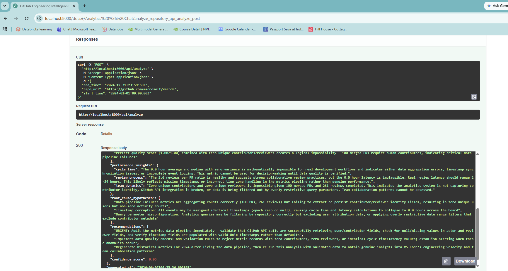
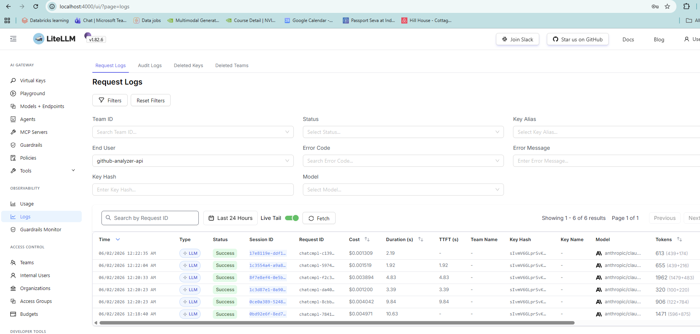

# Author Notes — Submission Notes

> What was built, why each decision was made, what was left out and why.
> This is the document to read alongside the code.

---

## What Was Built

A GitHub engineering intelligence platform that:

1. **Fetches meaningful data** from the GitHub GraphQL API — merged PRs, closed issues,
   submitted reviews, and per-contributor activity across any date range.

2. **Computes engineering metrics** — cycle time (PR open → merge), review latency
   (PR open → first review), velocity trend (early vs late half of the period),
   quality score, per-engineer contribution scores, top contributors and reviewers.

3. **Generates LLM narratives** (`POST /api/analyze`) — an executive summary with
   key findings, a performance interpretation per dimension (cycle time, review process,
   team dynamics), root-cause hypotheses, prioritised recommendations, and a
   `confidence_score` (0–1, penalised for small samples or missing reviewers).

4. **Supports conversational Q&A** (`POST /api/chat`) — multi-turn with full metrics
   context injected into the system prompt so the model can cite specific numbers.

5. **Provides an eval harness** (`POST /api/judge/compare`) — a blind LLM-as-a-Judge
   service for comparing prompt variants before changing production prompts.

### Live API response — `POST /api/analyze`



The screenshot shows a response against `microsoft/vscode` for the full year 2024.
Notably the model returned `confidence_score: 0.05` — it correctly identified that
100 PRs with zero unique contributors is logically impossible and flagged it as a
data pipeline issue (null author fields, timestamp corruption, or overly restrictive
GraphQL filters). This is the model doing exactly what the confidence score is for:
downgrading its own certainty when the underlying numbers don't add up.

---

## Why These Metrics?

**Cycle time** is the most actionable DORA-adjacent signal a team can observe without
production instrumentation. It measures the full delivery loop and correlates with
perceived engineering velocity. A gap between average and median reveals outlier PRs
dragging the mean.

**Review latency** is where teams lose the most time without realising it. A PR waiting
18 hours for first review is 18 hours of blocked work. It's also within a team's direct
control — unlike deployment pipelines.

**Velocity trend** (comparing the first and second half of the analysis period) gives
a directional signal without requiring historical persistence. It answers "are things
getting better or worse right now?" not just "what is the current level?".

**Contribution score** weights PRs and reviews together, avoiding the trap of ranking
purely on merged PRs (which disadvantages reviewers who unblock others) or purely on
review count (which disadvantages senior contributors doing complex, high-impact work).

---

## Why LiteLLM?

The API never calls Anthropic or Ollama directly. Every LLM request goes through
a LiteLLM proxy at `http://litellm:4000`. Reasons:

**Model aliasing.** The entire codebase uses `"model": "claude-haiku"`. Swapping to
a newer Anthropic model — or any other provider — is a one-line change in
`litellm-config.yaml`. No code change, no redeploy of application logic.

**Automatic failover.** `router_settings.fallbacks` transparently retries with
`ollama-llama3` if Claude fails (rate-limit, outage, quota). The application layer
never knows it happened. This means the service works even without an Anthropic key,
degrading to local Ollama.

**Spend visibility.** Every request is logged to PostgreSQL and visible in the LiteLLM
UI at `http://localhost:4000/ui`. Each call includes `metadata.operation`
(`summarize_metrics`, `chat`, `judge_variant`, `judge_eval`) for per-feature cost
breakdown without any custom instrumentation.



The screenshot shows the LiteLLM request log filtered by `Team: github-analyzer-api`.
Each row shows request ID, model, status, cost, token counts (input/output), and the
operation tag — giving full visibility into which features are driving LLM spend.

**Key isolation.** The Anthropic API key lives only in the LiteLLM container. The
application service holds only a `LITELLM_MASTER_KEY` (an internal proxy key). If
the application container is compromised, the Anthropic key is not exposed.

**`drop_params: true`.** Different providers accept different parameters. This setting
silently drops unsupported ones so the same payload structure works against Claude
and Ollama without provider-specific branching in application code.

---

## Why Not `response_format: {"type": "json_object"}`?

This was a painful discovery. Sending `response_format` to LiteLLM for a Claude model
causes LiteLLM to internally convert the request to Claude's tool-calling mechanism to
enforce structured output. The response then puts the JSON in
`choices[0].message.tool_calls[0].function.arguments` and sets `content = null`. A
naive content extractor returns an empty string, and `json.loads("")` fails with
"Expecting value: line 1 column 1 (char 0)".

**Fix**: `response_format` is never sent for summarize calls. JSON is enforced entirely
via the system prompt: *"your entire response must be a single valid JSON object. Start
your response with { and end with }."* The prompt also includes the exact schema as a
template so the model knows what keys to populate.

`_extract_response_content` additionally has a fallback that extracts from
`tool_calls[0].function.arguments` if `content` is null — so the service degrades
gracefully even if this pattern re-appears from an upstream LiteLLM change.

---

## Resiliency Design

LLM calls in the async path go through three nested layers:

```text
AsyncLimiter  (10 req/s)  — rate gate, prevents burst overload
  └─ RetryPolicy (3 attempts, 0.2s base, exponential + ±10% jitter)
       └─ aiobreaker CircuitBreaker (fail_max=3, timeout=60s)
```

**Why this order?**

The rate limiter sits outermost so it fires before any retry or circuit check — no
point consuming retry budget on a self-imposed rate limit.

The retry is *inner* and the circuit breaker is *outer*. This means one blip that
causes all 3 retries to fail counts as **one failure** toward the circuit breaker's
`fail_max`. Three complete retry sequences must all fail (9 total attempts) before
the circuit opens. This prevents a single transient network hiccup from opening
the breaker.

### Circuit breaker states

```text
                 N failures >= fail_max
CLOSED  ────────────────────────────────► OPEN
  ▲                                         │
  │  2 consecutive successes               │ timeout elapsed
  │                                         ▼
  └──────────────────────────── HALF_OPEN ◄─┘
                                    │
                                    └── any failure → back to OPEN
```

**CLOSED** — normal operation, failure counter increments on each failed retry sequence.

**OPEN** — all requests rejected immediately (no LLM call made). `/api/health` reports
`"degraded"`. The circuit stays open for `LITELLM_FAILURE_RECOVERY_SECONDS` (default 60s).

**HALF_OPEN** — one probe request is allowed through. Two consecutive successes close the
circuit. Any failure re-opens it immediately.

**Why 2 successes to close?** A single success after an outage may be noise. Two in a row
provides stronger evidence the service has actually recovered.

**Limitation**: circuit state is in-memory and resets on container restart. For production,
state should be persisted in Redis. For a demo service this is acceptable — a restart
during a degraded period effectively resets the breaker, which is usually the right
behaviour anyway.

---

## LLM-as-a-Judge — The Eval Harness

`POST /api/judge/compare` addresses the task's optional "eval harness" requirement.
The motivation: before changing a system prompt or swapping a model, you want to know
whether the change makes the output better or worse by a measurable criterion.

### How it works

```text
Request: input text + 2-10 variants (system prompt, user prompt, model, temperature)
  │
  ├─ Fan-out: asyncio.gather(*[_run_variant(v) for v in variants for _ in range(runs)])
  │   return_exceptions=True — one failed run does not cancel others
  │
  ├─ Aggregate: group by variant, average latency, keep last output per variant
  │
  ├─ Judge: send all outputs blind (labelled A/B/C, not by name) to the judge LLM
  │   temperature=0.1 — low for consistent, repeatable scoring
  │   judge prompt includes: score template, pairwise comparison template, winner field
  │
  └─ Build response: resolve labels → names, compute total_score, return JudgeResponse
```

### Why blind labelling?

Labels like "expert" or "v2" bias a judge LLM toward the label that sounds more capable.
Using neutral letters (A/B/C) isolates the quality of the output from the name of the
variant.

### Key bug that was fixed

The original `_aggregate_runs` used `i % len(variants)` to map each run back to its
variant. This is wrong when `runs_per_variant > 1`. With 2 variants and 2 runs each,
the flat list is `[v0_run0, v0_run1, v1_run0, v1_run1]`. The correct index is
`i // runs_per_variant`, not `i % len(variants)` (which would assign `v0_run1` to
variant 1 instead of variant 0).

---

## Caching Strategy

Two cache layers:

**Redis** (primary, 10-min TTL):

- `github:{owner}:{repo}:snapshot:{time_range}` — raw GraphQL response
- `summary:{owner}:{repo}:{period}` — LLM-generated `AnalysisSummary`

**In-memory dict** (fallback):

If Redis is unavailable, `CacheService` logs a warning and falls back to a process-local
dict. This means repeated identical requests re-hit the LLM during a Redis outage, but
the service stays up. In-memory cache is lost on restart.

**What was not cached**: the judge service results — judge runs are inherently
exploratory, not repeatable queries with stable inputs, so caching them would be wrong.

---

## Security Considerations

**Secrets**: `GITHUB_TOKEN` and `ANTHROPIC_API_KEY` are env vars only. LiteLLM holds
the Anthropic key; the API service never sees it. Nothing is logged at a level that
would expose token values.

**CORS**: `allow_origins=["*"]` with `allow_credentials=False`. This is correct for an
open API without browser-side auth. `allow_credentials=True` with a wildcard origin is
invalid per the CORS spec and browsers reject it.

**Input validation**: all request bodies are validated by Pydantic before any service
code runs. The chat endpoint has an `input_guardrail()` that rejects empty messages.
The judge endpoint caps inputs at 10,000 characters and 10 variants.

**What is missing for production**: API authentication (API key middleware or OAuth),
Redis AUTH, HTTPS termination, and explicit `allow_origins` (replacing `"*"`).

---

## Performance Considerations

**GitHub GraphQL** pages results in batches of 100. For large repos with thousands of
PRs in a period, this can result in multiple sequential HTTP calls. The raw response is
cached in Redis so repeat queries with the same parameters are free.

**LLM latency** is the bottleneck — Claude Haiku typically responds in 2–8 seconds for
a summary prompt. The 10-min Redis cache ensures this cost is paid once per
repo+period+user combination.

**Async throughout**: all API routes are `async def`. GitHub calls are currently sync
`httpx` (a known tech debt item). LLM calls are fully async via `httpx.AsyncClient`
and `asyncio.gather` for the judge fan-out.

**No quadratic loops**: contributor score calculation iterates the PR list once. The
analytics service is O(n) in the number of PRs for all metrics.

---

## What Was Intentionally Left Out

**Frontend / dashboard**: not built. The Swagger UI (`/docs`) serves as the demo
interface. A React dashboard is on the roadmap (Phase 4) but would have taken longer
to build than the backend itself.

**Background sync**: all GitHub fetches happen on demand. A periodic worker that
pre-fetches popular repos would improve p99 latency significantly. Skipped because it
requires a persistent database schema and a task scheduler, which would have added
substantial complexity for a demo.

**Persistent historical storage**: metrics are cached for 10 minutes, not stored
permanently. Building a time-series store (TimescaleDB or plain Postgres) would enable
trend analysis over weeks and months. This is the highest-value Phase 2 item.

**Auth**: no API key validation on the endpoints. Straightforward to add (FastAPI
middleware or a dependency), but out of scope for the initial submission.

**GitLab / Bitbucket adapters**: the `analytics_service` and `llm_service` are fully
decoupled from the data source. Adding a new integration means implementing a new
service with the same interface as `github_service.py` — no other code needs to change.

---

## On AI-Assisted Development

Claude Code was used throughout this project. The workflow was:

1. **Specification → code**: gave the model the requirements and reviewed every file
   it produced before accepting.
2. **Debugging**: when errors surfaced (the `response_format` / tool-calls issue, the
   Docker health-check failures, the `_aggregate_runs` index bug), described the
   symptoms and worked with the model to trace the root cause before accepting a fix.
3. **Pushed back on wrong outputs**: the model initially suggested keeping
   `response_format` in the payload "just in case" — that was rejected because it is
   exactly what causes the empty-content bug. The final code removes it entirely.

Every line in this codebase was reviewed and is code I would ship to production.

---

## Flow Reference (Condensed)

```text
POST /api/analyze
  1. GitHubService.fetch_repository_data()   ← GraphQL, Redis-cached
  2. AnalyticsService.generate_metrics()     ← pure computation, O(n) PRs
  3. LLMService.summarize_metrics_async()
       ├─ Redis cache check
       ├─ _build_summary_prompt(metrics)     ← real numbers + benchmark context
       ├─ _execute_chat_async()
       │    └─ ResilientClient.call()
       │         ├─ AsyncLimiter (10 req/s)
       │         ├─ RetryPolicy  (3 attempts, exp backoff)
       │         └─ aiobreaker   (fail_max=3, timeout=60s)
       │              └─ POST litellm:4000/v1/chat/completions
       │                   model: claude-haiku → Anthropic (or ollama fallback)
       ├─ _extract_response_content()        ← handles choices / tool_calls fallback
       ├─ _strip_json_fences()               ← removes ```json``` and extracts {...}
       └─ json.loads() → AnalysisSummary → Redis cache

POST /api/judge/compare
  1. asyncio.gather(*[_run_variant(v) for variants × runs])
  2. _aggregate_runs()   ← i // runs_per_variant mapping
  3. _judge()            ← blind A/B/C labels, temp=0.1, json.loads
  4. _build_response()   ← resolve labels, fallback total_score, JudgeResponse
```
